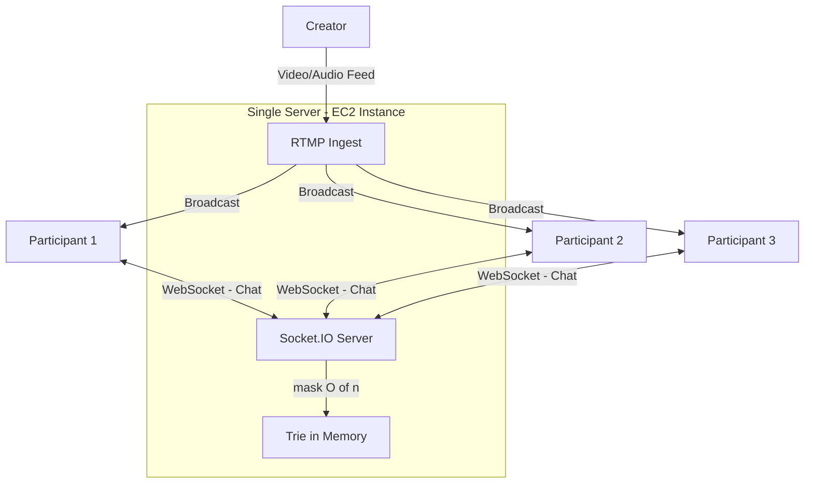
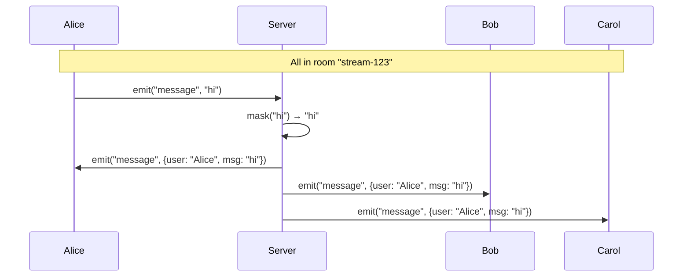
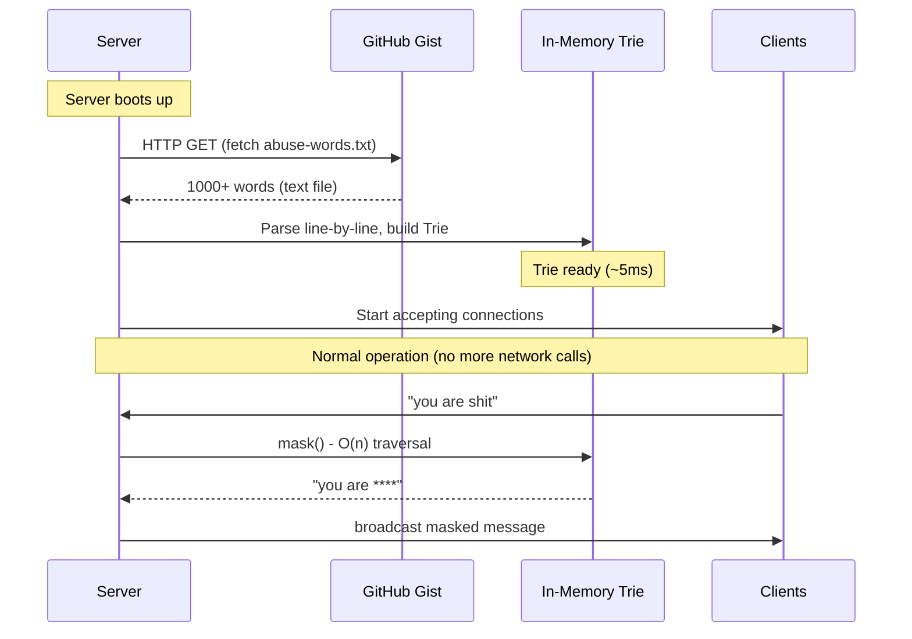
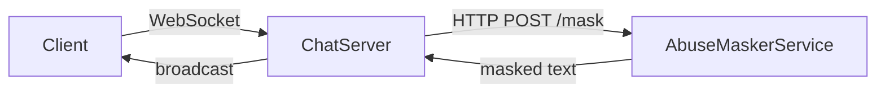
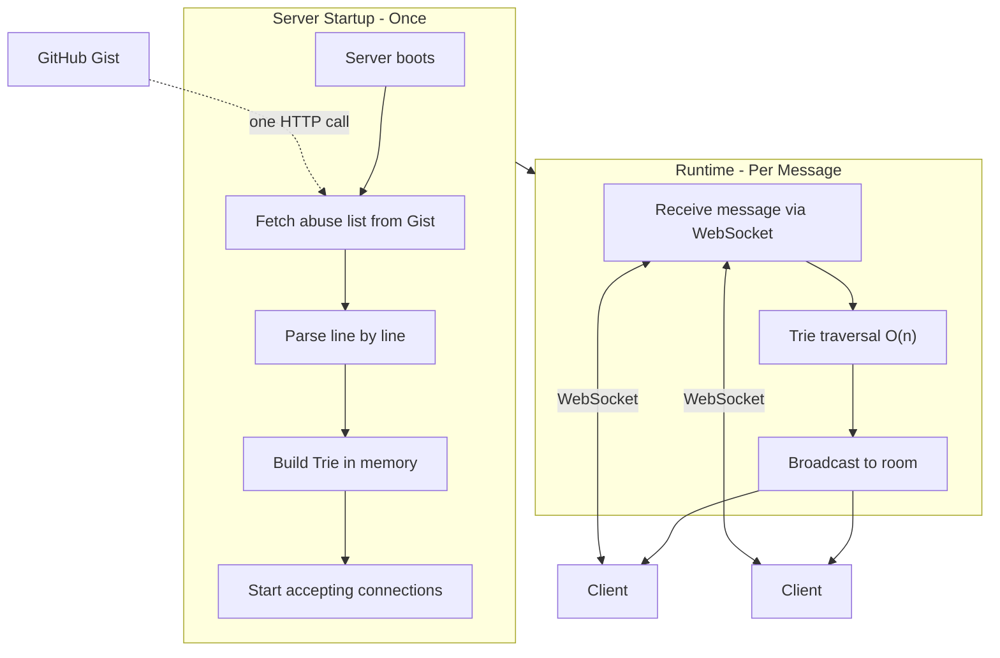

# Real-time Abuse Masker

> **Motive: Not everything needs to be a service.**

This implementation demonstrates how to build a real-time abuse masker for live stream chat. The key lesson: understand when something should be a library loaded in-memory vs a separate networked service.

---

## Problem Statement

Consider a video live stream platform like YouTube Live, Instagram Live, or Twitch:

**Setup:**
- One creator is streaming video/audio (captured via camera, sent over RTMP)
- Hundreds or thousands of participants are watching
- Everyone is connected to a single server (for simplicity, one EC2 instance)
- There's a chat box where participants can send messages
- Messages are broadcast to everyone in real-time

**The Problem:**
- Some users send abusive messages: profanity, slurs, harassment
- As a platform, you cannot allow these messages to reach other users
- You need to **mask** these abuses in real-time before broadcast

**Example:**
```
User types:    "you are such a fucking idiot"
Others see:    "you are such a ******* *****"
```

The masking must happen:
- In **real-time** (milliseconds, not seconds)
- At **scale** (thousands of messages per second during popular streams)
- **Consistently** (everyone sees the same masked version)



---

## Understanding the Architecture

### Why Single Server?

For most live streams, a single powerful server is sufficient:
- YouTube Live: ~100-10,000 concurrent viewers for most creators
- Instagram Live: typically <1,000 viewers
- Small Twitch streamers: 10-500 viewers

Only massive streams (100k+ viewers) need distributed architecture. For this demo, we focus on the single-server case which covers 99% of use cases.

### Components

| Component | Technology | Purpose |
|-----------|------------|---------|
| Video Streaming | RTMP + WebRTC | Capture and broadcast creator's feed |
| Chat Server | Socket.IO (WebSocket) | Real-time bidirectional messaging |
| Abuse Masker | Trie (in-memory) | O(n) string masking |
| Abuse Dictionary | GitHub Gist / S3 | Centralized word list |

The video streaming part (RTMP, WebRTC) is a separate problem. We focus entirely on the **chat messaging** and **abuse masking**.

---

## WebSocket vs HTTP

Understanding why we use WebSocket for chat:

### HTTP (Request-Response)

```
Client                          Server
  |                                |
  |-------- GET /messages -------->|
  |<------- [msg1, msg2] ----------|
  |                                |
  |-------- GET /messages -------->|  (poll again)
  |<------- [msg1, msg2, msg3] ----|
  |                                |
```

**Problems with HTTP for chat:**
- **Polling overhead**: Client must repeatedly ask "any new messages?"
- **Latency**: Messages delayed until next poll
- **Wasted requests**: Most polls return nothing new
- **Connection overhead**: Each request = new TCP connection (HTTP/1.1)

### WebSocket (Persistent Bidirectional)

```
Client                          Server
  |                                |
  |======= WebSocket Open =========|  (one-time handshake)
  |                                |
  |<------- msg1 -----------------|  (server pushes instantly)
  |<------- msg2 -----------------|
  |-------- "hello" ------------->|  (client sends)
  |<------- msg3 -----------------|
  |                                |
  |        (connection stays open) |
```

**Why WebSocket for chat:**
- **Persistent connection**: One handshake, then instant messaging
- **Bidirectional**: Server can push without client asking
- **Low latency**: Messages arrive in milliseconds
- **Efficient**: No repeated connection setup

### The Numbers

| Metric | HTTP Polling (1s interval) | WebSocket |
|--------|---------------------------|-----------|
| Latency to receive message | 0-1000ms (avg 500ms) | <50ms |
| Requests per minute (idle) | 60 | 0 |
| Connection overhead | High (TCP handshake each time) | One-time |
| Battery/bandwidth (mobile) | High | Low |

---

## Socket.IO and Rooms

Socket.IO is a library that wraps WebSocket with additional features:

### What Socket.IO Adds

1. **Automatic reconnection**: If connection drops, it reconnects
2. **Fallback**: Falls back to HTTP long-polling if WebSocket unavailable
3. **Rooms**: Logical grouping of connections for broadcasting
4. **Acknowledgements**: Confirm message delivery
5. **Binary support**: Send files, images efficiently

### The Room Concept

A "room" is a virtual channel. Sockets can join/leave rooms, and you can broadcast to everyone in a room.

```javascript
// Server side
io.on("connection", (socket) => {
  // User joins a room (the live stream)
  socket.on("join", (streamId) => {
    socket.join(streamId);  // e.g., "stream-123"
  });
  
  // When user sends a message
  socket.on("message", (text) => {
    // Broadcast to everyone in the room
    io.to("stream-123").emit("message", text);
  });
});
```

```javascript
// Client side
const socket = io("http://server:3000");

socket.emit("join", "stream-123");

socket.on("message", (data) => {
  console.log(`${data.username}: ${data.message}`);
});

socket.emit("message", "Hello everyone!");
```

### How Broadcast Works



When Alice sends a message:
1. Server receives it
2. Server runs abuse masking
3. Server broadcasts to everyone in the room (including Alice)

**Our masking logic sits at step 2** - before broadcast, after receive.

---

## Abuse Dictionary Storage

### Where to Store the Word List?

The abuse dictionary is a simple text file with one word per line:

```
shit
fuck
damn
bastard
asshole
...
```

**Storage options:**

| Option | Pros | Cons |
|--------|------|------|
| Hardcoded in code | Simple, fast | Requires deploy to update |
| Local file | Simple | Hard to sync across servers |
| S3 bucket | Centralized, versioned | AWS dependency |
| GitHub Gist | Free, public, easy to update | Rate limits, public |
| Database | Query-able, admin UI ready | Overkill, slower startup |

For this demo, we use **GitHub Gist**:

**Gist URL:** https://gist.github.com/pulkitxm/37f313430190581b04a44ed10fc16cab

### Loading Strategy



**Key insight:** Only ONE network call at startup. After that, it's all in-memory.

### File Size Reality Check

How big is an abuse dictionary?

```
Assume:
- 5,000 abusive words/phrases
- Average word length: 6 characters
- Total: 5,000 × 6 = 30,000 bytes = 30 KB

With newlines: ~35 KB
```

That's **nothing**. Downloads in <100ms even on slow connections.

---

## Approach 1: Tokenize + HashSet (Naive)

The first approach most developers think of:

### Algorithm

```
function maskAbuse(message, abuseSet):
    tokens = message.split(" ")           // Step 1: Tokenize
    result = []
    
    for token in tokens:                  // Step 2: Check each
        if token.toLowerCase() in abuseSet:
            result.append("*" × len(token))
        else:
            result.append(token)
    
    return result.join(" ")               // Step 3: Reconstruct
```

### Example Walkthrough

```
Input:  "mondays are shit bro"
Set:    {"shit", "fuck", "damn", ...}

Step 1 - Tokenize:
  ["mondays", "are", "shit", "bro"]

Step 2 - Check each:
  "mondays" → not in set → keep
  "are"     → not in set → keep
  "shit"    → IN SET     → "****"
  "bro"     → not in set → keep

Step 3 - Reconstruct:
  "mondays are **** bro"
```

### Why This Is Inefficient

**Problem 1: Tokenization creates memory overhead**

```
Original string: "this is a very long message with many words"
                 (44 characters, 1 string object)

After split:     ["this", "is", "a", "very", "long", "message", "with", "many", "words"]
                 (9 string objects + array overhead)
```

For a 100-character message, you're creating ~15-20 new string objects.

**Problem 2: HashSet string comparison is O(k)**

HashSet lookup is O(1) for the bucket, but **comparing strings is O(k)** where k = string length.

```
Checking "motherfucker" (12 chars):
  1. Compute hash: O(12)
  2. Find bucket: O(1)
  3. Compare with bucket contents: O(12) per comparison
```

**Problem 3: Multiple passes through data**

```
Pass 1: Split string into tokens (read all chars)
Pass 2: Check each token (read all chars again via hash)
Pass 3: Join tokens back (read all chars again)
```

That's effectively **O(3n)** with high constant factors.

**Problem 4: Punctuation handling is messy**

```
Input: "you're shit, honestly!"

Naive split by space: ["you're", "shit,", "honestly!"]

"shit," won't match "shit" in the set!
```

You need complex regex or additional parsing to handle punctuation.

---

## Approach 2: Trie Data Structure (Optimal)

### What is a Trie?

A **Trie** (pronounced "try", from re**TRIE**val) is a tree data structure for storing strings where:
- Each node represents a single character
- Path from root to node spells out a prefix
- Nodes marked as "end of word" indicate complete words

### Visual Example

Storing words: `["bad", "bat", "bar", "cat", "car"]`

```
                    (root)
                   /      \
                  b        c
                  |        |
                  a        a
                / | \     / \
               d  t  r   t   r
               ↑  ↑  ↑   ↑   ↑
              end end end end end
```

### Trie vs HashSet: Memory Layout

**HashSet (Hash Table):**
```
Bucket 0: ["shit", "shut"]     // collision
Bucket 1: []
Bucket 2: ["fuck"]
Bucket 3: ["damn", "darn"]     // collision
...
Bucket N: ["asshole"]
```
- Each word stored as complete string
- Hash collisions require full string comparison

**Trie:**
```
s → h → i → t (end)
         ↘ u → t (end)
f → u → c → k (end)
d → a → m → n (end)
         ↘ r → n (end)
```
- Characters shared across words with common prefixes
- "shit" and "shut" share "sh"
- No hash collisions, just tree traversal

### Memory Efficiency for Abuse Words

Many abuse words share prefixes:

```
fuck, fucker, fucking, fucked    → share "fuck"
shit, shitty, shithead           → share "shit"
ass, asshole, asswipe            → share "ass"
damn, damned, damnit             → share "damn"
```

The Trie naturally deduplicates these prefixes.

### Trie Node Structure

```typescript
class TrieNode {
  children: Map<string, TrieNode> = new Map();
  isEndOfWord: boolean = false;
}

class Trie {
  root: TrieNode = new TrieNode();
  
  insert(word: string): void {
    let node = this.root;
    for (const char of word.toLowerCase()) {
      if (!node.children.has(char)) {
        node.children.set(char, new TrieNode());
      }
      node = node.children.get(char)!;
    }
    node.isEndOfWord = true;
  }
}
```

### Insertion Example

Inserting "shit":

```
Before: (root) → empty

Step 1: Insert 's'
(root) → s

Step 2: Insert 'h'
(root) → s → h

Step 3: Insert 'i'
(root) → s → h → i

Step 4: Insert 't' + mark end
(root) → s → h → i → t(end)
```

Inserting "shut" (shares "sh"):

```
Before: (root) → s → h → i → t(end)

Step 1: 's' exists, follow it
Step 2: 'h' exists, follow it
Step 3: 'u' doesn't exist, create it
(root) → s → h → i → t(end)
                 ↘ u

Step 4: 't' + mark end
(root) → s → h → i → t(end)
                 ↘ u → t(end)
```

---

## The O(n) Masking Algorithm

This is the core innovation. Instead of tokenizing, we traverse the message **character by character** while simultaneously traversing the Trie.

### The Algorithm

```
function mask(message, trie):
    result = []
    wordStart = 0
    currentNode = trie.root
    matchEnd = -1
    
    for i from 0 to len(message):
        char = message[i] if i < len(message) else ''
        isAlpha = char.match(/[a-zA-Z]/)
        
        if isAlpha:
            # Try to follow this character in the trie
            nextNode = currentNode.children.get(char.lower())
            
            if nextNode exists:
                currentNode = nextNode
                if currentNode.isEndOfWord:
                    matchEnd = i  # Potential match ending here
            else:
                # No match possible, reset
                currentNode = trie.root
                matchEnd = -1
        else:
            # Word boundary (space, punctuation, end)
            if matchEnd >= 0 and matchEnd == i - 1:
                # We had a match that ended right before this boundary
                wordLength = matchEnd - wordStart + 1
                result.append("*" × wordLength)
            else:
                # No match, copy the word as-is
                for j from wordStart to i:
                    result.append(message[j])
            
            if i < len(message):
                result.append(char)  # Keep the space/punctuation
            
            # Reset for next word
            wordStart = i + 1
            currentNode = trie.root
            matchEnd = -1
    
    return result.join("")
```

### Detailed Walkthrough

**Input:** `"mondays are shit bro"`  
**Trie contains:** `"shit"`

```
Index: 0  1  2  3  4  5  6  7  8  9  10 11 12 13 14 15 16 17 18 19
Char:  m  o  n  d  a  y  s     a  r  e     s  h  i  t     b  r  o
```

**Character-by-character:**

| i | char | isAlpha | Trie State | Action |
|---|------|---------|------------|--------|
| 0 | 'm' | yes | root→? no 'm' | reset, stay at root |
| 1 | 'o' | yes | root→? no 'o' | reset |
| 2 | 'n' | yes | root→? no 'n' | reset |
| 3 | 'd' | yes | root→? no 'd' | reset |
| 4 | 'a' | yes | root→? no 'a' | reset |
| 5 | 'y' | yes | root→? no 'y' | reset |
| 6 | 's' | yes | root→s? **yes!** | move to 's', but not end |
| 7 | ' ' | no | **word boundary** | copy "mondays " |
| 8 | 'a' | yes | root→? no 'a' | reset |
| 9 | 'r' | yes | root→? no 'r' | reset |
| 10 | 'e' | yes | root→? no 'e' | reset |
| 11 | ' ' | no | **word boundary** | copy "are " |
| 12 | 's' | yes | root→s? **yes!** | move to 's' |
| 13 | 'h' | yes | s→h? **yes!** | move to 'h' |
| 14 | 'i' | yes | h→i? **yes!** | move to 'i' |
| 15 | 't' | yes | i→t? **yes! + isEnd!** | move to 't', matchEnd=15 |
| 16 | ' ' | no | **word boundary** | matchEnd=15, replace with "****" |
| 17 | 'b' | yes | root→? no 'b' | reset |
| 18 | 'r' | yes | root→? no 'r' | reset |
| 19 | 'o' | yes | root→? no 'o' | reset |
| 20 | EOF | no | **word boundary** | copy "bro" |

**Output:** `"mondays are **** bro"`

### Why This is O(n)

- We visit each character **exactly once**
- At each character, we do O(1) operations:
  - One Map lookup (`children.get(char)`)
  - One boolean check (`isEndOfWord`)
  - One array append
- Total: **O(n)** where n = message length

No tokenization. No string comparisons. No multiple passes.

### Multiple Matches Example

**Input:** `"you fucking piece of shit"`  
**Trie contains:** `["fucking", "shit"]`

```
Processing:
- "you " → no match → copy
- "fucking" → f→u→c→k→i→n→g (end!) → "****ing"? 

Wait, we need the WHOLE word to match, not partial.

Actually at ' ' boundary after 'g':
- matchEnd points to 'g' which is end of "fucking"
- Replace entire word: "*******"

- " piece of " → no matches → copy
- "shit" → s→h→i→t (end!) → "****"

Output: "you ******* piece of **** "
```

---

## Why NOT a Separate Service?

This is the **most important lesson** of this entire exercise.

### The Tempting (Wrong) Architecture

Many developers would design this:



"I'll create a microservice! It's clean! It's separated! It's... scalable?"

### Why This is Wrong

**Let's do the math:**

| Operation | Latency |
|-----------|---------|
| Trie traversal (in-memory, 100 char message) | ~1-10 μs (microseconds) |
| HTTP request (same datacenter) | ~1-5 ms (milliseconds) |
| HTTP request (cross-AZ) | ~5-20 ms |
| HTTP request (cross-region) | ~50-200 ms |

**1 millisecond = 1,000 microseconds**

By making a network call, you're adding **100x-1000x latency** for a computation that takes microseconds.

### HTTP/1.1 Overhead Breakdown

For **every single chat message**, an HTTP call would do:

```
Step 1: TCP 3-way handshake
  Client → SYN → Server
  Client ← SYN-ACK ← Server
  Client → ACK → Server
  (3 round trips, ~1-3ms)

Step 2: Send HTTP request
  Client → POST /mask HTTP/1.1
           Host: abuse-service
           Content-Type: application/json
           
           {"text": "you are shit"}
  (1 round trip, ~0.5-1ms)

Step 3: Server processes
  (~0.01ms for trie traversal)

Step 4: Receive HTTP response
  Server → HTTP/1.1 200 OK
           Content-Type: application/json
           
           {"masked": "you are ****"}
  (1 round trip, ~0.5-1ms)

Step 5: TCP termination
  Client → FIN → Server
  Client ← ACK ← Server
  Server → FIN → Client
  Server ← ACK ← Client
  (4 packets, ~1-2ms)

TOTAL: ~4-8ms for a 0.01ms computation
```

### Scale Impact

Consider a popular stream with:
- 10,000 concurrent viewers
- 50 messages per second (people chatting)

**With separate service:**
```
50 messages/sec × 5ms per HTTP call = 250ms of HTTP waiting per second
50 messages/sec × 8 TCP packets = 400 packets/sec just for masking
```

Your abuse masker service becomes a bottleneck. You need to scale it, add load balancers, handle failures, add retries, add circuit breakers...

**With in-memory trie:**
```
50 messages/sec × 0.01ms per mask = 0.5ms of CPU time per second
```

The chat server barely notices the masking. It's **500x more efficient**.

### When SHOULD You Use a Service?

A separate service makes sense when:

| Criteria | Abuse Masker | Service Needed? |
|----------|--------------|-----------------|
| Shared mutable state | No (read-only trie) | No |
| Heavy computation | No (O(n) string scan) | No |
| Different scaling needs | No (scales with chat) | No |
| Different team ownership | Maybe | Maybe |
| GPU/specialized hardware | No | No |
| External API calls | No | No |

Examples where a service IS appropriate:
- **Image moderation**: Needs ML models, GPU, heavy computation
- **User authentication**: Shared state (sessions), security boundary
- **Payment processing**: External APIs, compliance requirements
- **Search**: Complex indexing, different scaling characteristics

### The Right Mental Model

Ask yourself:
> "Is this a **computation** or a **coordination**?"

- **Computation**: Transform input → output, no side effects, deterministic
  - → Library, in-memory, same process
  
- **Coordination**: Manage shared state, talk to external systems, handle failures
  - → Service, separate process, network boundary

Abuse masking is pure computation: `string → string`. It belongs in-memory.

---

## The Final Architecture



### Startup Phase

1. Server process starts
2. **One HTTP call** to fetch abuse list from Gist/S3
3. Parse the text file line by line
4. Insert each word into the Trie
5. Trie is ready in memory (~5-10ms for 5000 words)
6. Start Socket.IO server, accept connections

### Runtime Phase (per message)

1. User sends message via WebSocket
2. Server calls `mask(message)` - **pure in-memory, O(n)**
3. Server broadcasts masked message to room
4. All clients receive the masked version

**Zero network calls during normal operation.**

---

## Handling Edge Cases

### Case Sensitivity

```
Trie contains: "shit"

Input: "SHIT", "Shit", "sHiT"
Should all match!

Solution: Lowercase during trie traversal
```

```typescript
getChild(node: TrieNode, char: string): TrieNode | null {
  return node.children.get(char.toLowerCase()) ?? null;
}
```

### Punctuation Attached to Words

```
Input: "that's shit, honestly."

The word "shit," has a comma attached.
The word "honestly." has a period.
```

Our algorithm handles this naturally because:
- We detect word boundaries on ANY non-alphabetic character
- The comma/period triggers the boundary check
- If the word before the punctuation matches, we mask it

```
Processing "shit,":
s → h → i → t (matchEnd=3, isEnd=true)
',' is non-alpha → word boundary → match confirmed → "****,"
```

### Partial Matches (Substrings)

```
Trie contains: "ass"

Input: "class assignment"

We DON'T want to mask "cl***" or "***ignment"!
```

Our algorithm only masks **complete words**:
- "class" → c(no match), reset... "ass" never starts fresh
- "assignment" → same, no match

The trie match must start at a word boundary (after space/start) and end at a word boundary (before space/punctuation/end).

### Words Within Words

```
Trie contains: "shit"

Input: "bullshit is bad"

Should "bullshit" be masked?
```

With current algorithm: **No**, because "b" doesn't start a trie match.

If you WANT to catch this:
- Option 1: Add "bullshit" explicitly to the dictionary
- Option 2: Implement substring matching (more complex, O(n×m))

For most use cases, exact word matching is preferred (fewer false positives).

### Unicode and Emojis

```
Input: "you're 💩 and shit"

The 💩 emoji is non-alphabetic, so it acts as a word boundary.
"shit" after it will be correctly matched and masked.
```

---

## Performance Characteristics

### Time Complexity

| Operation | Complexity | Notes |
|-----------|------------|-------|
| Build trie (startup) | O(W × L) | W = word count, L = avg word length |
| Mask message | O(n) | n = message length |
| Memory lookup | O(1) | Map.get() per character |

### Space Complexity

| Structure | Space | Notes |
|-----------|-------|-------|
| Trie nodes | O(W × L) | Shared prefixes reduce this |
| Per-message | O(n) | Output string buffer |

### Benchmarks (Approximate)

On a modern server (c5.large, 2 vCPU):

| Metric | Value |
|--------|-------|
| Trie build (5000 words) | ~5-10 ms |
| Mask 100-char message | ~5-20 μs |
| Mask 1000-char message | ~50-200 μs |
| Messages/second (single core) | ~50,000-200,000 |

You could process **millions of messages per second** with a few cores. The trie is not the bottleneck—network I/O is.

### Memory Usage

```
5000 words × 6 avg chars × 24 bytes per TrieNode ≈ 720 KB

With Map overhead and V8 object headers: ~2-5 MB
```

That's **nothing** for a server with 4-16 GB RAM.

---

## Code Walkthrough

### Project Structure

```
abuse-masker/
├── package.json           # Dependencies: socket.io, socket.io-client
├── tsconfig.json          # TypeScript config
├── .gitignore             # Ignores abuse-words.txt (downloaded)
└── src/
    ├── abuse-words-source.ts   # URL and path constants
    ├── trie.ts                 # Trie data structure
    ├── masker.ts               # O(n) masking algorithm
    ├── pull-abuse-words.ts     # Standalone fetch script
    ├── server.ts               # Socket.IO chat server
    └── client.ts               # CLI chat client
```

### `trie.ts` - Data Structure

```typescript
class TrieNode {
  children: Map<string, TrieNode> = new Map();
  isEndOfWord = false;
}

export class Trie {
  root: TrieNode = new TrieNode();
  
  insert(word: string): void {
    let node = this.root;
    for (const char of word.toLowerCase().trim()) {
      if (!node.children.has(char)) {
        node.children.set(char, new TrieNode());
      }
      node = node.children.get(char)!;
    }
    node.isEndOfWord = true;
  }
  
  // Used by masker for character-by-character traversal
  getChild(node: TrieNode, char: string): TrieNode | null {
    return node.children.get(char.toLowerCase()) ?? null;
  }
  
  isEnd(node: TrieNode): boolean {
    return node.isEndOfWord;
  }
  
  async loadFromUrl(url: string): Promise<void> {
    const response = await fetch(url);
    const content = await response.text();
    for (const line of content.split("\n")) {
      const word = line.trim();
      if (word) this.insert(word);
    }
  }
}
```

### `masker.ts` - Algorithm

```typescript
export class AbuseMasker {
  private trie: Trie;

  constructor(trie: Trie) {
    this.trie = trie;
  }

  mask(message: string): string {
    const result: string[] = [];
    let wordStart = 0;
    let currentNode = this.trie.root;
    let matchEnd = -1;

    for (let i = 0; i <= message.length; i++) {
      const char = i < message.length ? message[i] : "";
      const isAlpha = /[a-zA-Z]/.test(char);

      if (isAlpha) {
        const nextNode = this.trie.getChild(currentNode, char);
        if (nextNode) {
          currentNode = nextNode;
          if (this.trie.isEnd(currentNode)) matchEnd = i;
        } else {
          currentNode = this.trie.root;
          matchEnd = -1;
        }
      } else {
        // Word boundary
        if (matchEnd >= 0 && matchEnd === i - 1) {
          result.push("*".repeat(matchEnd - wordStart + 1));
        } else {
          for (let j = wordStart; j < i; j++) result.push(message[j]);
        }
        if (i < message.length) result.push(char);
        wordStart = i + 1;
        currentNode = this.trie.root;
        matchEnd = -1;
      }
    }
    return result.join("");
  }
}
```

### `server.ts` - Chat Server

```typescript
const ABUSE_WORDS_URL = "https://gist.githubusercontent.com/.../abuse-words.txt";

async function main() {
  // 1. Load trie at startup
  const trie = new Trie();
  await trie.loadFromUrl(ABUSE_WORDS_URL);
  const masker = new AbuseMasker(trie);
  
  // 2. Create Socket.IO server
  const io = new Server(httpServer);
  
  io.on("connection", (socket) => {
    socket.on("join", (username) => {
      socket.join("chat-room");
      socket.broadcast.to("chat-room").emit("user-joined", { username });
    });
    
    socket.on("message", (text, ack) => {
      // 3. Mask abuse BEFORE broadcast
      const masked = masker.mask(text);
      
      // 4. Broadcast to room
      socket.broadcast.to("chat-room").emit("message", { username, message: masked });
      
      // 5. Acknowledge to sender
      ack({ username, message: masked });
    });
  });
  
  httpServer.listen(3000);
}
```

---

## Usage

```bash
# Install dependencies
bun install

# (Optional) Pre-fetch abuse words
bun pull-abuse-words

# Terminal 1: Start server
bun server
# Output:
# Fetching abuse word list from: https://gist.githubusercontent.com/...
# Loaded 1043 abuse words into trie
# Chat server running on http://localhost:3000

# Terminal 2: First client
bun client
# Enter username: Alice
# Type messages...

# Terminal 3: Second client
bun client
# Enter username: Bob
# Type messages...
```

### Demo Session

**Alice's terminal:**
```
══════════════════════════════════════════════
  Real-time Abuse Masker Chat
══════════════════════════════════════════════

Username: Alice
● Connected as Alice
──────────────────────────────────────────────

› Hey Bob!
[1:30 AM] You    Hey Bob!
[1:30 AM] Bob    Hi Alice, how are you?
› I'm good, this lag is bullshit though
[1:31 AM] You    I'm good, this lag is ******** though
[1:31 AM] Bob    lol yeah mondays are ****
```

**Bob's terminal:**
```
[1:30 AM] Alice  Hey Bob!
› Hi Alice, how are you?
[1:30 AM] You    Hi Alice, how are you?
[1:31 AM] Alice  I'm good, this lag is ******** though
› lol yeah mondays are shit
[1:31 AM] You    lol yeah mondays are ****
```

Both see the same masked output. The original text never reaches anyone unmasked.

---

## Key Takeaways

### 1. Not Everything Needs to Be a Service

A network call adds milliseconds. An in-memory operation takes microseconds. Know the difference. For pure computation like string masking, keep it in-memory.

### 2. Trie Enables O(n) String Matching

By traversing message and trie simultaneously, character by character, we avoid tokenization, avoid hash lookups, and achieve true linear time complexity.

### 3. Load Once, Use Forever

One network call at startup to fetch the dictionary. After that, it's pure in-memory computation. This is the pattern: bootstrap from external source, then operate locally.

### 4. Simple Systems Scale

This entire abuse masker is ~200 lines of TypeScript. It can handle hundreds of thousands of messages per second. Complexity is the enemy of reliability and performance.

### 5. Ask "Why" Before Adding Complexity

Every network call, every service boundary, every database query—ask if it's truly necessary. Often, the simplest solution is also the fastest.

### 6. Understand Your Data Structures

HashSet has O(1) bucket lookup but O(k) string comparison. Trie has O(1) per character. For string matching, Trie wins. Know when to use what.

### 7. Real-Time Requires In-Process

For sub-millisecond latency requirements (chat, gaming, trading), you cannot afford network hops. The computation must happen in the same process that handles the connection.
