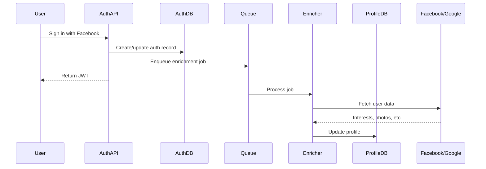
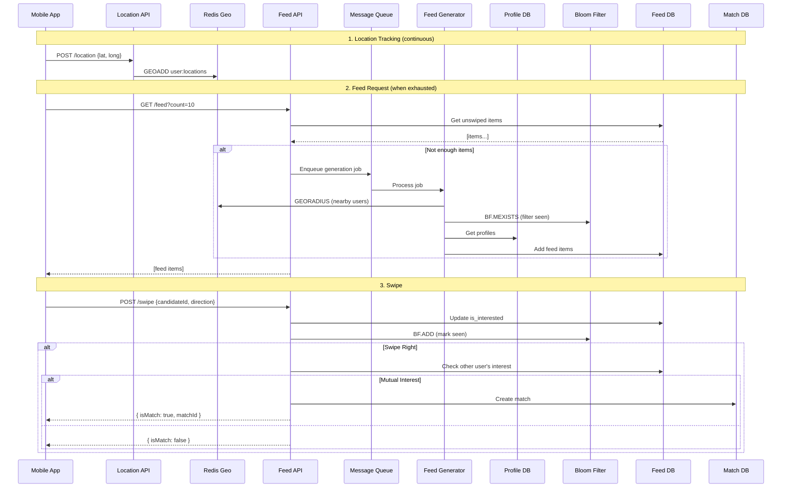

# Tinder Feed System Design

> **Motive: Playing with location-based data and keeping things efficient at scale.**

This implementation demonstrates how to design the feed system for a Tinder-like application. The key challenges: handling real-time location data, generating personalized feeds based on proximity and interests, preventing duplicate profile views, and detecting matches between users.

---

## TL;DR

- **Location tracking** uses Redis geospatial commands (GEOADD, GEORADIUS) to store and query user positions
- **Profile storage** in a document-like structure (Redis JSON) with interests for matching
- **Feed generation** scores candidates by proximity (40%) and common interests (60%)
- **Bloom filters** prevent showing already-swiped profiles with zero false negatives
- **Feed database** stores items separately (not as a list) to avoid document size limits
- **Match detection** checks bidirectional interest when either user swipes right
- **Async processing** via BullMQ for non-blocking feed generation

---

## Problem Statement

Design a feed for Tinder with the feature to swipe left (no) or right (yes). For a great user experience, a profile that a user has already swiped must never appear again.

**What makes this interesting:**
1. Location-based data at scale (continuous GPS updates)
2. Keeping things efficient when data isn't the problem, but query load is
3. Zero-repetition guarantees with space-efficient data structures
4. Match detection across millions of users

---

## Architecture

```
┌─────────────────────────────────────────────────────────────────────────┐
│                           USER DEVICES                                   │
│  ┌─────────┐  ┌─────────┐  ┌─────────┐                                  │
│  │ App 1   │  │ App 2   │  │ App N   │  → emit lat/long every 30s      │
│  └────┬────┘  └────┬────┘  └────┬────┘                                  │
└───────┼────────────┼────────────┼───────────────────────────────────────┘
        │            │            │
        └────────────┼────────────┘
                     │
                     ▼
┌─────────────────────────────────────────────────────────────────────────┐
│                        LOCATION TRACKER                                  │
│                                                                          │
│   HTTP POST /location                                                    │
│   { user_id, lat, long }        ──────────▶   Redis GEO                 │
│   (auth token in header)                      GEOADD user:locations     │
│                                               user_id lat long          │
└─────────────────────────────────────────────────────────────────────────┘

┌─────────────────────────────────────────────────────────────────────────┐
│                        PROFILE SERVICE                                   │
│                                                                          │
│   ┌─────────────┐      ┌─────────────┐      ┌─────────────┐            │
│   │  Auth API   │─────▶│   Queue     │─────▶│  Enrichers  │            │
│   │ (Social     │      │ (SQS/Kafka) │      │ (Facebook,  │            │
│   │  Login)     │      │             │      │  Google)    │            │
│   └──────┬──────┘      └─────────────┘      └──────┬──────┘            │
│          │                                          │                   │
│          ▼                                          ▼                   │
│   ┌─────────────┐                          ┌─────────────┐             │
│   │  Auth DB    │                          │  Profile DB │             │
│   │ (Postgres)  │                          │ (Mongo/     │             │
│   │             │                          │  DynamoDB)  │             │
│   └─────────────┘                          └─────────────┘             │
└─────────────────────────────────────────────────────────────────────────┘

┌─────────────────────────────────────────────────────────────────────────┐
│                          FEED SYSTEM                                     │
│                                                                          │
│   When feed exhausted:                                                   │
│   ┌─────────────┐      ┌─────────────┐      ┌─────────────┐            │
│   │  Feed API   │─────▶│   Queue     │─────▶│    Feed     │            │
│   │             │      │             │      │  Generator  │            │
│   └─────────────┘      └─────────────┘      └──────┬──────┘            │
│                                                     │                   │
│                              ┌──────────────────────┼──────────────┐    │
│                              │                      │              │    │
│                              ▼                      ▼              ▼    │
│                      ┌─────────────┐      ┌─────────────┐  ┌──────────┐│
│                      │  Redis GEO  │      │  Profile DB │  │  Bloom   ││
│                      │  GEORADIUS  │      │  (interests)│  │  Filter  ││
│                      └─────────────┘      └─────────────┘  └──────────┘│
│                                                     │                   │
│                                                     ▼                   │
│                                            ┌─────────────┐             │
│                                            │  Feed DB    │             │
│                                            │ (DynamoDB)  │             │
│                                            └─────────────┘             │
└─────────────────────────────────────────────────────────────────────────┘

┌─────────────────────────────────────────────────────────────────────────┐
│                         SWIPE & MATCH                                    │
│                                                                          │
│   On swipe:                                                              │
│   ┌─────────────┐      ┌─────────────┐      ┌─────────────┐            │
│   │  Swipe API  │─────▶│  Feed DB    │─────▶│   Bloom     │            │
│   │             │      │  (update    │      │   Filter    │            │
│   │             │      │  is_inter-  │      │  (BF.ADD)   │            │
│   │             │      │   ested)    │      │             │            │
│   └──────┬──────┘      └─────────────┘      └─────────────┘            │
│          │                                                              │
│          │ if swipe right                                               │
│          ▼                                                              │
│   ┌─────────────┐      ┌─────────────┐                                 │
│   │ Check other │─────▶│  Match DB   │  ← if mutual interest           │
│   │ user's feed │      │             │                                 │
│   └─────────────┘      └─────────────┘                                 │
└─────────────────────────────────────────────────────────────────────────┘
```

---

## Feed Criteria

The feed should show profiles based on two criteria:

### 1. Proximity
People nearby are more likely to want to meet. The closer someone is, the higher they should rank in your feed.

### 2. Common Interests
If there's nothing in common, the user will likely swipe left. More shared interests = higher chance of a match = better for the business.

---

## Deep Dive: Capturing Proximity

### How Location Updates Work

User devices (the Tinder app) continuously emit location data to our backend:

```
Every 30 seconds:
  POST /api/location
  Headers: { Authorization: Bearer <token> }
  Body: { latitude: 37.7749, longitude: -122.4194 }
```

The server:
1. Validates the auth token
2. Extracts user_id from the token
3. Updates the location entry in the database

```typescript
async function updateLocation(userId: string, location: Location): Promise<void> {
  await redis.geoadd(
    "user:locations",
    location.longitude,
    location.latitude,
    userId
  );
}
```

### Why Redis for Location Data?

We need a database that:
1. **Supports geospatial queries** - "Give me all users within 10km"
2. **Handles high write throughput** - Millions of location updates per minute
3. **Is easily shardable** - One node can't handle the load

Redis checks all three boxes:
- `GEOADD` / `GEORADIUS` / `GEODIST` for geospatial operations
- In-memory operations are microseconds
- Cluster mode for horizontal scaling

### Data Size Math

Let's calculate the storage requirement:

```
Per user:
  - user_id:  4 bytes (32-bit integer or UUID prefix)
  - latitude: 4 bytes (32-bit float)
  - longitude: 4 bytes (32-bit float)
  Total: 12 bytes per user

At scale:
  - 50 million users × 12 bytes = 600 MB
```

**600 MB. That's nothing.** A single Redis instance can easily hold this.

### The Real Problem: Query Load

Data size is NOT the problem. **Query load is the problem.**

With 50 million users, each emitting location every 30 seconds:
```
50,000,000 users ÷ 30 seconds = 1.67 million writes/second
```

One Redis node can handle ~100k writes/second. We need at least 17 nodes just for writes.

**Solution: Location-based sharding.** Users in the same geographic region go to the same shard. This also makes GEORADIUS queries efficient since nearby users are on the same shard.

### Redis Geospatial Commands

```typescript
// Add location
await redis.geoadd("user:locations", -122.4194, 37.7749, "user-123");

// Get location
const pos = await redis.geopos("user:locations", "user-123");
// Returns: [["-122.41940...", "37.77489..."]]

// Find nearby users (within 10km)
const nearby = await redis.georadius(
  "user:locations",
  -122.4194, 37.7749,  // center point
  10, "km",            // radius
  "WITHDIST",          // include distance
  "ASC",               // sort by distance
  "COUNT", 50          // limit results
);
// Returns: [["user-456", "2.5"], ["user-789", "5.1"], ...]

// Distance between two users
const dist = await redis.geodist("user:locations", "user-123", "user-456", "km");
// Returns: "2.5"
```

---

## Deep Dive: Capturing Common Interests

### Where Do Interests Come From?

Two sources:

1. **User-provided**: Ask during onboarding ("Select your interests")
2. **Social login enrichment**: Scrape from connected accounts

### Social Login Flow



### Profile Storage

Why a document database (MongoDB/DynamoDB) for profiles?

- **No standard schema**: Facebook returns different fields than Google
- **Nested data**: Arrays of interests, photos, etc.
- **Flexible queries**: Filter by various attributes

```typescript
interface UserProfile {
  id: string;
  name: string;
  age: number;
  bio: string;
  interests: string[];      // ["Music", "Travel", "Coffee"]
  photos: string[];         // URLs
  gender: "male" | "female" | "other";
  lookingFor: ("male" | "female" | "other")[];
  lastActive: number;
  createdAt: number;
}
```

### Interest Matching

```typescript
function calculateCompatibilityScore(
  profile1: UserProfile,
  profile2: UserProfile,
  distanceMeters: number,
  maxDistanceMeters: number
): number {
  // Gender preference check
  if (!isGenderMatch(profile1, profile2)) {
    return 0;
  }

  // Common interests (Jaccard similarity)
  const common = profile1.interests.filter(i => 
    profile2.interests.includes(i)
  );
  const total = new Set([...profile1.interests, ...profile2.interests]).size;
  const interestScore = total > 0 ? common.length / total : 0;

  // Distance score (closer = higher)
  const distanceScore = Math.max(0, 1 - distanceMeters / maxDistanceMeters);

  // Weighted combination
  return interestScore * 0.6 + distanceScore * 0.4;
}
```

---

## Deep Dive: When to Generate Feed

### The Trigger: Feed Exhaustion

Who knows when the feed is about to run out? **The frontend.**

The app shows profiles one at a time. When the user is on profile #8 out of 10, the app makes an API call to request more:

```
GET /api/feed?count=10
Headers: { Authorization: Bearer <token> }
```

### Why Not Backend Counter?

Alternative approach: Backend tracks how many profiles the user has seen and proactively generates more.

**Problems:**
1. Extra network call on every swipe to increment counter
2. Backend doesn't know viewing speed (user might swipe fast or slow)
3. More state to manage

**Keep it simple.** Frontend knows best when to request more. Backend just responds to requests.

### Async Feed Generation

Feed generation involves:
1. GEORADIUS query for nearby users
2. Profile lookups for each candidate
3. Bloom filter checks
4. Scoring and sorting
5. Writing to feed database

This can take 100-500ms. Don't block the API response.

```typescript
// Feed API
app.get("/api/feed", async (req, res) => {
  const userId = req.user.id;
  
  // Return cached items immediately
  const cached = await feedDatabase.getUnswipedFeedItems(userId, 10);
  if (cached.length >= 10) {
    return res.json(cached);
  }
  
  // Enqueue generation for more items
  await feedQueue.add("generate-feed", {
    userId,
    count: 20,
    radiusKm: 50
  });
  
  // Return what we have
  res.json(cached);
});
```

---

## Deep Dive: Feed Database Design

### The Explosion Problem

Every user can potentially see every other user. Worst case:

```
N users × N users = N² entries

50 million × 50 million = 2.5 × 10^15 entries
```

That's 2.5 quadrillion entries. Even at 100 bytes per entry, that's 250 petabytes.

**Reality check:** Most users won't swipe millions of times. But we still need to plan for scale.

### Approach 1: Store Candidate User ID

```typescript
interface FeedItem_V1 {
  userId: string;          // whose feed this is
  candidateId: string;     // who appears in the feed
  createdAt: number;
  isInterested: boolean | null;
}
```

**Structure in DynamoDB:**
- Hash key: `userId` (partition by)
- Sort key: `createdAt` (order by, descending)

**Pros:**
- Minimal storage (~50 bytes per item)
- Easy to shard by userId

**Cons:**
- When serving feed, must fetch profile from Profile DB
- Extra network call for each profile shown

### Approach 2: Store Full Candidate Profile

```typescript
interface FeedItem_V2 {
  userId: string;
  candidateId: string;
  candidateProfile: UserProfile;  // embedded
  createdAt: number;
  isInterested: boolean | null;
}
```

**Pros:**
- No extra network call when serving feed
- All data in one read

**Cons:**
- Storage bloat (~500 bytes per item)
- **Stale data risk**: If candidate updates profile, feed shows old version

### The Trade-off

| Aspect | Store ID | Store Profile |
|--------|----------|---------------|
| Storage | ~50 bytes | ~500 bytes |
| Serve latency | +1 network call | No extra call |
| Data freshness | Always fresh | Can be stale |
| Write cost | Lower | Higher |

**Pick your battle.** Both are valid. This implementation stores the full profile for simpler serving logic.

### Why NOT Store as a List?

Tempting approach:

```typescript
// DON'T DO THIS
interface UserFeed {
  userId: string;
  items: FeedItem[];  // array of all feed items
}
```

**Problems:**

1. **Document size limits**: MongoDB max 16MB, DynamoDB max 400KB
2. **Unbounded growth**: User swipes 10,000 times = 10,000 items in array
3. **Expensive operations**: Adding item = read entire doc, append, write entire doc
4. **Serialization cost**: Every read/write serializes the whole array

**Solution:** Each feed item is a separate document.

```
// In DynamoDB:
PK: feed#user-123    SK: 2024-01-15T10:30:00Z#candidate-456
PK: feed#user-123    SK: 2024-01-15T10:31:00Z#candidate-789
PK: feed#user-123    SK: 2024-01-15T10:32:00Z#candidate-012
...
```

---

## Deep Dive: Swiping Mechanics

### On Swipe: Update Feed Database

When user swipes left or right:

```typescript
async function handleSwipe(
  userId: string,
  candidateId: string,
  direction: "left" | "right"
): Promise<SwipeResult> {
  const isInterested = direction === "right";
  
  // 1. Update feed database
  await feedDatabase.updateSwipe(userId, candidateId, isInterested);
  
  // 2. Mark as seen in Bloom filter
  await bloomFilter.add(userId, candidateId);
  
  // 3. If right swipe, check for match
  if (isInterested) {
    return await checkForMatch(userId, candidateId);
  }
  
  return { isMatch: false };
}
```

### Match Detection Logic

When A swipes right on B:

```typescript
async function checkForMatch(
  userA: string,
  userB: string
): Promise<{ isMatch: boolean; matchId?: string }> {
  // Check if B has A in their feed and swiped right
  const bFeedItem = await feedDatabase.getFeedItem(userB, userA);
  
  // Case 1: B hasn't seen A yet (no feed entry)
  if (!bFeedItem) {
    return { isMatch: false };
  }
  
  // Case 2: B saw A but hasn't swiped yet
  if (bFeedItem.isInterested === null) {
    return { isMatch: false };
  }
  
  // Case 3: B swiped left on A
  if (bFeedItem.isInterested === false) {
    return { isMatch: false };
  }
  
  // Case 4: B swiped right on A - IT'S A MATCH!
  const match = await matchStore.createMatch(userA, userB);
  return { isMatch: true, matchId: match.id };
}
```

### Match Flow Diagram

```
┌─────────┐                              ┌─────────┐
│  Alex   │                              │  Sarah  │
└────┬────┘                              └────┬────┘
     │                                        │
     │ Swipe RIGHT on Sarah                   │
     ├───────────────────────────────────────▶│
     │                                        │
     │ Check: Does Sarah like Alex?           │
     │ → No entry or is_interested=null       │
     │ → No match yet                         │
     │                                        │
     │                     Swipe RIGHT on Alex│
     │◀───────────────────────────────────────┤
     │                                        │
     │          Check: Does Alex like Sarah?  │
     │          → is_interested=true ✓        │
     │          → CREATE MATCH! 💕            │
     │                                        │
     │◀──────── Match Notification ──────────▶│
     │                                        │
```

---

## Deep Dive: Zero Repetition with Bloom Filters

### The Problem

Once a user swipes a profile (left or right), they should **never** see it again.

Naive approach: Store all `(user_id, seen_user_id)` pairs.

```
Storage calculation:
- 50M users
- Each swipes 10,000 profiles on average
- 8 bytes per pair (two 4-byte IDs)

50M × 10K × 8 bytes = 4 TB
```

4 TB just to track "who has seen whom." That's expensive.

### Why Bloom Filters Are Perfect

Bloom filters are probabilistic data structures that answer:
- **"Definitely NOT in set"** - 100% certain
- **"Might be in set"** - could be false positive

For Tinder:
- **False positive** = Skip a profile the user hasn't seen → Miss a potential match (acceptable)
- **False negative** = Show a profile the user already swiped → Bad UX (NOT acceptable)

Bloom filters **guarantee no false negatives**. They're perfect for this use case.

### How Bloom Filters Work

```
┌─────────────────────────────────────────────────────────────┐
│                     Bit Array (m bits)                       │
│  [0][0][0][0][0][0][0][0][0][0][0][0][0][0][0][0]...         │
└─────────────────────────────────────────────────────────────┘

To ADD "profile-123":
  1. hash1("profile-123") % m → bit position 3
  2. hash2("profile-123") % m → bit position 7
  3. hash3("profile-123") % m → bit position 12
  4. Set bits 3, 7, 12 to 1

┌─────────────────────────────────────────────────────────────┐
│  [0][0][0][1][0][0][0][1][0][0][0][0][1][0][0][0]...         │
└─────────────────────────────────────────────────────────────┘
            ↑           ↑               ↑
           bit 3      bit 7           bit 12

To CHECK "profile-456":
  1. hash1("profile-456") % m → bit 5 → is 0? → DEFINITELY NOT IN SET

To CHECK "profile-123":
  1. hash1("profile-123") % m → bit 3 → is 1? ✓
  2. hash2("profile-123") % m → bit 7 → is 1? ✓
  3. hash3("profile-123") % m → bit 12 → is 1? ✓
  All set → MIGHT BE IN SET (or false positive)
```

### Redis Bloom Filter Commands

```typescript
// Reserve a filter (on first use)
await redis.call("BF.RESERVE", "seen:user-123", 0.01, 10000);
// 0.01 = 1% false positive rate
// 10000 = expected number of items

// Add to filter
await redis.call("BF.ADD", "seen:user-123", "candidate-456");

// Check if exists
const exists = await redis.call("BF.EXISTS", "seen:user-123", "candidate-456");
// Returns 1 (might exist) or 0 (definitely not)

// Batch check
const results = await redis.call(
  "BF.MEXISTS", "seen:user-123",
  "candidate-456", "candidate-789", "candidate-012"
);
// Returns [1, 0, 1]
```

### Storage Comparison

```
Bloom filter (10K capacity, 1% error rate):
  Size per filter: ~12 KB
  50M users: 50M × 12KB = 600 GB

Naive approach (storing pairs):
  50M users × 10K swipes × 8 bytes = 4 TB

Savings: 6.5x reduction
```

### Integration with Feed Generator

```typescript
async function generateFeed(userId: string, count: number): Promise<FeedItem[]> {
  // 1. Get nearby users
  const nearbyUsers = await locationTracker.getNearbyUsers(userId, 50, count * 3);
  
  // 2. Batch check Bloom filter
  const candidateIds = nearbyUsers.map(u => u.userId);
  const seenStatus = await bloomFilter.hasSeenMany(userId, candidateIds);
  
  // 3. Filter out seen profiles
  const unseenCandidates = nearbyUsers.filter(u => !seenStatus.get(u.userId));
  
  // 4. Score and add to feed...
}
```

---

## Deep Dive: Match Creation

### Match Database Structure

```typescript
interface Match {
  id: string;           // UUID for this match
  userA: string;
  userB: string;
  createdAt: number;
}
```

The `match.id` becomes the channel ID for messaging. Any post-match feature (chat, video call, date scheduling) references this ID.

### Query Patterns

```typescript
// Get all matches for a user
const matches = await redis.smembers(`matches:${userId}`);

// Get match details
const match = await redis.get(`match:${matchId}`);

// Check if two users are matched
async function hasMatch(userA: string, userB: string): Promise<boolean> {
  const matches = await getMatchesForUser(userA);
  return matches.some(m => 
    (m.userA === userA && m.userB === userB) ||
    (m.userA === userB && m.userB === userA)
  );
}
```

---

## The Complete Flow



---

## Design Decisions Summary

| Decision | Choice | Trade-off |
|----------|--------|-----------|
| Location storage | Redis GEO | Memory usage vs query speed |
| Profile storage | Document DB (Redis JSON in demo) | Flexibility vs query complexity |
| Feed item storage | Separate documents | Write amplification vs query patterns |
| Seen tracking | Bloom filter | Space efficiency vs false positives |
| Feed generation | Async queue | Latency vs user experience |
| Match detection | Feed DB lookup | Simplicity vs dedicated match service |

---

## Performance Characteristics

### Time Complexity

| Operation | Complexity | Notes |
|-----------|------------|-------|
| Location update | O(log N) | Redis GEOADD is sorted set insert |
| Nearby query | O(log N + M) | M = results within radius |
| Bloom filter add | O(k) | k = number of hash functions |
| Bloom filter check | O(k) | k = number of hash functions |
| Feed generation | O(M × log M) | M = candidates, sorting by score |
| Swipe | O(1) | Update + Bloom add |
| Match check | O(1) | Single feed item lookup |

### Space Complexity

| Data | Per User | 50M Users |
|------|----------|-----------|
| Location | 12 bytes | 600 MB |
| Profile | ~500 bytes | 25 GB |
| Bloom filter | ~12 KB | 600 GB |
| Feed items | ~500 bytes × 100 | 2.5 TB |

### Scaling Properties

| Component | Scaling Strategy |
|-----------|-----------------|
| Location Redis | Shard by geo region |
| Profile DB | Shard by user ID |
| Feed DB | Shard by user ID |
| Bloom filters | Shard by user ID |
| Feed generators | Horizontal (stateless workers) |

---

## Setup

```bash
# Install dependencies
pnpm install

# Start Redis Stack (includes RedisBloom)
docker-compose up -d

# Verify Redis modules
pnpm init

# Seed sample data
pnpm seed
```

Redis Insight UI: http://localhost:8001

## Demos

### Location Tracking

```bash
pnpm demo:location
```

Shows GEOADD, GEOPOS, GEODIST, GEORADIUS commands in action.

### Feed Generation

```bash
pnpm demo:feed
```

Generates feed based on proximity and interest matching.

### Bloom Filter

```bash
pnpm demo:bloom
```

Demonstrates Bloom filter preventing duplicate profile views.

### Swiping

```bash
pnpm demo:swipe
```

Swipe mechanics with Bloom filter integration.

### Match Detection

```bash
pnpm demo:match
```

Full flow: two users swiping right on each other → match created.

### Complete Walkthrough

```bash
pnpm demo:all
```

End-to-end demonstration of the entire system.

## Cleanup

```bash
pnpm reset              # Clear all data
docker-compose down -v  # Stop Redis
```

---

## Key Takeaways

### 1. Data Size vs Query Load
600 MB for 50 million user locations is nothing. But 1.67 million writes/second requires 17+ shards. **Query load is the real scaling challenge, not storage.**

### 2. Bloom Filters for Deduplication
When you need "definitely not seen" guarantees, Bloom filters give you 6.5x storage reduction with controllable false positive rates. Perfect for preventing duplicate content.

### 3. Don't Store Lists
Document size limits, serialization costs, and unbounded growth make list storage problematic. Store items separately with composite keys.

### 4. Async for Non-Critical Paths
Feed generation can be slow. Don't block the API. Return what you have and generate more in the background.

### 5. Simple Match Detection
A match is just bidirectional interest. Check the feed database, no need for a complex match service.

### 6. Trade-offs Are Everywhere
Store ID vs full profile? Accuracy vs space? Latency vs throughput? There's no single right answer. Understand the trade-offs and pick what fits your constraints.

---

## Exercises

1. **Explore Redis Bloom filters**: Try different error rates and capacities. Observe false positive rates as the filter fills up.

2. **Explore Redis geospatial**: Write queries to find users within various radii. Measure query latency as the dataset grows.

3. **Implement "Super Like"**: Add a super_like field to swipes. How does this change match detection?

4. **Add "Undo"**: Allow users to undo their last swipe. What happens to the Bloom filter? (Hint: Bloom filters don't support deletion)

5. **Implement "Boost"**: Temporarily prioritize a user's profile in others' feeds. What's the scoring adjustment?

---

## Related

- [Bloom Filters](../../../bloom-filters) - In-depth Bloom filter implementation
- [Rate Limiter](../../../rate-limiter) - Redis Lua scripts for atomic operations
- [Consistent Hashing](../../../consistent-hashing) - For sharding location data

---

## References

- Inspired by [Arpit Bhayani's](https://arpitbhayani.me/) system design lectures
- [Redis Geospatial](https://redis.io/docs/data-types/geospatial/) documentation
- [RedisBloom](https://redis.io/docs/stack/bloom/) documentation
